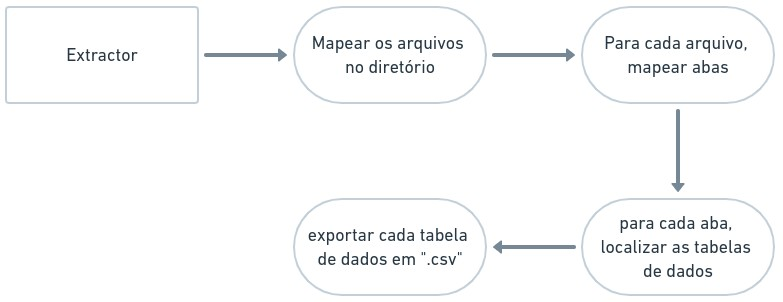

<h2 style="text-align: left">

  [Apresentação](#ovr) | [Procedimento](#proc) | [Próxima »](https://github.com/vcwild/wtp-clean)

</h2>

# Apresentação <a name="ovr">

## Extração de Dados

Serão utilizadas planilhas de mensuração da qualidade da água em uma Estação de Tratamento de Esgoto entre os anos de 2013 a 2019.  
Os dados de origem foram escritos em documentos “xlsx”, dispostos em formato tabular, cujas entidades e parâmetros receberam nomes e unidades distintos ao longo do tempo.

## Objetivo

O objetivo inicial é mapear os dados originais como são, localizando as abas e tabelas dentro delas, retirando os dados das tabelas e exportando para arquivos "csv" individuais, conforme indica o fluxograma:

As particularidades de cada tabela foram excluídas do fluxograma. Ao todo foram encontrados 18 formatos únicos de tabela.

# Procedimento <a name="proc">

O extrator localizou os seguintes conjuntos de dados referente a **parâmetros** nos arquivos de origem:

- Acidez
- Alcalinidade
- Coliformes
- Compostagem
- Cor Verdadeira
- DBO
- DQO
- Fósforo
- Nitrogênio
- Óleos
- pH
- Sólidos
- Surfactantes

O extrator localizou os seguintes dados referente a **localidades** nos arquivos de origem:

- CONSEMA
- Leito de Secagem
- PTEL

## Próximas Etapas

- [Tratamento de Dados](https://github.com/vcwild/wtp-clean)
- [Análise Exploratória](https://github.com/vcwild/wtp-eda)
- [Modelagem de Séries Temporais](https://github.com/vcwild/wtp-model)